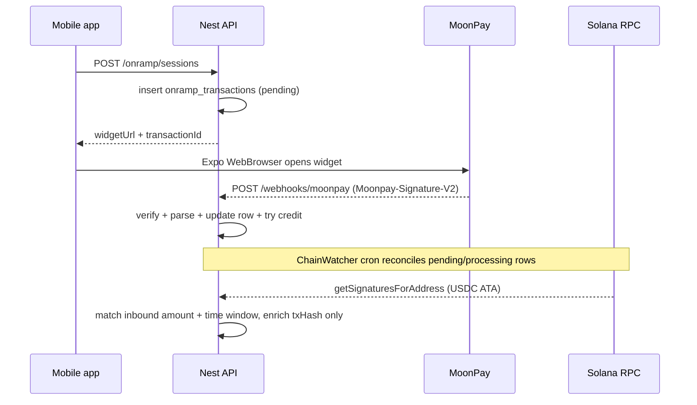

# On-ramp (Circle card flow + MoonPay widget)

This folder contains two complementary paths:

1. **Legacy / Circle Payments** — `POST /onramp` with encrypted card tokenization (`ONRAMP_PROVIDER=circle|mock`).
2. **MoonPay widget** — `POST /onramp/sessions` returns a signed `widgetUrl`; webhooks hit `POST /webhooks/moonpay` (legacy alias: `POST /onramp/webhooks/moonpay`).

Custodial Solana addresses live on `wallets.solana_pubkey` (not Circle Programmable Wallets).

## Provider abstraction (widget path)

| Piece | Role |
|--------|------|
| `widget/onramp-widget-provider.interface.ts` | Contract: `createWidgetSession`, `verifyWebhook`, `parseWebhook`. |
| `widget/moonpay-widget.provider.ts` | MoonPay URL signing (HMAC-SHA256 over the query string, base64 digest) and webhook verification (`Moonpay-Signature-V2`: `HMAC-SHA256(webhookKey, t + '.' + rawBody)`). |
| `onramp-sessions.service.ts` | Persists `onramp_transactions`, correlates webhooks by `internalReference`. |
| `widget-onramp-settlement.service.ts` | Idempotent ledger + balance credit (`onramp_widget_credit:{rowId}`). |

### Adding Transak (checklist)

1. Add `transak` to `CreateOnrampSessionDto` / mobile provider enum.
2. Implement `TransakWidgetProvider` against `OnrampWidgetProvider` (session URL + webhook verify/parse + `NormalizedOnrampEvent`).
3. Register provider in `OnrampSessionsService.createSession` switch and add `POST /onramp/webhooks/transak` branch (or reuse generic controller with factory).
4. Extend `getOnrampWebClient('transak')` on mobile for redirect / WebView rules.
5. Add integration tests mirroring `moonpay-widget.provider.spec.ts`.

## Webhook + chain watcher (sequence)

- **Webhooks** are the primary status driver (MoonPay `transaction_*` events).
- **Chain reconciliation** (`chain-watcher/solana-onramp-reconcile.service.ts`) runs every minute for recent MoonPay rows and enriches on-chain hash/amount. It must not mark an on-ramp successful before a verified `completed` MoonPay webhook.

## Local dev (MoonPay sandbox)

1. Copy `.env.example` → `.env` and fill `MOONPAY_PUBLIC_KEY`, `MOONPAY_SECRET_KEY`, and `MOONPAY_WEBHOOK_SECRET` from the MoonPay dashboard (sandbox).
2. Expose webhooks: `ngrok http 4000` and register `https://<id>.ngrok-free.app/api/v1/webhooks/moonpay` in the MoonPay webhook settings.
3. Set `APP_REDIRECT_URL` to the same scheme the app handles (default `mcbuse://onramp/complete`); configure that return URL in the MoonPay partner settings if required.
4. Run DB migration `pnpm exec drizzle-kit migrate` (or apply `drizzle/0001_onramp_transactions.sql`).
5. Mobile: set `EXPO_PUBLIC_ONRAMP_REDIRECT_URL` to match `APP_REDIRECT_URL`.

### Sandbox cards

Use MoonPay’s [sandbox testing guide](https://dev.moonpay.com/docs/faq-sandbox-testing) test card numbers (Visa/Mastercard 3DS flows).

### Funding devnet USDC without MoonPay

Use [Circle’s faucet](https://faucet.circle.com/) or send devnet USDC from another wallet to the user’s `wallets.solana_pubkey` savings address.

### Expected state transitions

| Flow | `onramp_transactions.status` |
|------|-------------------------------|
| User abandons widget | stays `pending` until expiry job → `expired` |
| Card failure | `failed` (from webhook) |
| User cancels / MoonPay cancels | `cancelled` from webhook; local browser dismissal is shown in UI but does not mark success |
| Success | `completed` only after verified MoonPay `completed` webhook; balance credit is idempotent |

## Deviation notes

- **Solana cluster**: MoonPay’s public sandbox matrix lists Solana **testnet**; this project defaults to **devnet** (`SOLANA_RPC_URL`) and Circle’s devnet USDC mint. Confirm with MoonPay that your widget sends to devnet before relying on reconciliation.
- **Signed URL handling**: the mobile app opens the signed URL directly with Expo WebBrowser and only routes the internal transaction id through Expo Router.
