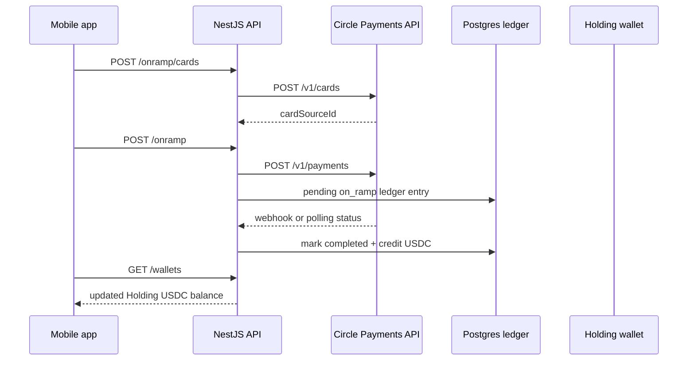

# Circle Technical Video Guide

Target length: 4:30-4:50. Keep the recording under 5 minutes.

## Core Message

MCBuse is a stablecoin-native payment app on Solana. The product uses USDC as the primary balance unit for the Holding Account and Routine Account. Circle is integrated on the backend for card-funded on-ramp through Circle Payments, Circle card tokenization, and asynchronous settlement through Circle webhooks or polling.

Be precise in the video:

- Implemented Circle pieces: Circle API client, public encryption key proxy, card creation/tokenization, Circle Payments on-ramp provider, Circle webhook settlement, Circle polling fallback.
- Implemented USDC pieces: Solana devnet USDC mint, integer base-unit accounting, Holding/Routine balances, ledger entries, widget on-ramp USDC settlement.
- Planned Circle pieces: Circle Payouts off-ramp is stubbed; Circle Wallets, CCTP, and Gateway are not currently used.
- Current mobile Top Up screen uses the widget session flow with `provider: 'stripe'`. If showing the Circle on-ramp path, demo it as an API/CLI flow unless the mobile Circle card UI has been wired before recording.

## Recording Outline

### 0:00-0:25 - Product And Architecture

Show the mobile home screen or README top-up section.

Narration:

> MCBuse is a mobile-first stablecoin payment app. Users keep funds in a Holding Account, move spendable funds into a Routine Account, and send or receive USDC and EURC. The relevant Circle integration is the fiat-to-USDC path: a user starts a card top-up, Circle creates the payment, and our backend credits the user's Holding wallet after Circle confirms settlement.

Quick architecture diagram to show or attach:

### 0:25-1:20 - Data Model And USDC Accounting

Show:

- `apps/api/src/database/schema/wallets.ts`
- `apps/api/src/database/schema/balances.ts`
- `apps/api/src/database/schema/ledger-entries.ts`
- `apps/api/.env.example`

Narration:

> Each user gets two custodial Solana wallets: savings, which we label as Holding in the UI, and routine, which is the spending wallet. The wallet table stores the Solana public key and an AES-GCM encrypted keypair. Balances are stored separately by currency, and USDC/EURC amounts are integers in base units, so the API never uses floating point for ledger accounting. The ledger table records every balance mutation with an idempotency key. For USDC on Solana devnet, the configured mint is `4zMMC9srt5Ri5X14GAgXhaHii3GnPAEERYPJgZJDncDU`.

Key code points:

- `wallets.solanaPubkey` and encrypted key storage: `apps/api/src/database/schema/wallets.ts`
- `balances.available` as bigint base units: `apps/api/src/database/schema/balances.ts`
- `ledgerEntries.idempotencyKey`: `apps/api/src/database/schema/ledger-entries.ts`
- `SOLANA_USDC_MINT`: `apps/api/.env.example`

### 1:20-2:35 - Circle On-Ramp Code Walkthrough

Show:

- `apps/api/src/onramp/onramp.module.ts`
- `apps/api/src/onramp/circle/circle.client.ts`
- `apps/api/src/onramp/onramp.service.ts`
- `apps/api/src/onramp/providers/circle-onramp.provider.ts`

Narration:

> The on-ramp module registers a provider abstraction. When `ONRAMP_PROVIDER=circle`, the API uses `CircleOnRampProvider`. `CircleClient` centralizes the Circle base URL and bearer-token authentication, defaulting to Circle sandbox unless `CIRCLE_BASE_URL` is overridden.
>
> The card flow starts with `GET /onramp/encryption-key`, which proxies Circle's public encryption key, then `POST /onramp/cards`, which sends encrypted card details to Circle and returns a Circle card ID. The actual top-up calls `POST /onramp`. The service loads the user's Holding wallet, generates an idempotency key, and passes the wallet ID, Solana public key, amount, currency, and card source ID to the provider.
>
> Inside `CircleOnRampProvider`, we convert base units into Circle's decimal amount string, map USDC to USD and EURC to EUR for the Circle payment amount, then call `POST /v1/payments`. Circle statuses are normalized into our internal `completed`, `pending`, or `failed` states.

Key code points:

- Provider selection: `apps/api/src/onramp/onramp.module.ts`
- Circle HTTP wrapper: `apps/api/src/onramp/circle/circle.client.ts`
- Encryption key and card tokenization: `apps/api/src/onramp/onramp.service.ts`
- Circle payment creation: `apps/api/src/onramp/providers/circle-onramp.provider.ts`

### 2:35-3:25 - Settlement, Webhook, And Idempotency

Show:

- `apps/api/src/onramp/circle/circle-webhook.controller.ts`
- `apps/api/src/onramp/circle/circle-polling.service.ts`
- `apps/api/src/onramp/circle/circle-settlement.service.ts`

Narration:

> Circle payment settlement is asynchronous, so pending payments are not credited immediately. We support two settlement paths. In webhook mode, `POST /webhooks/circle` verifies the Circle signature when a webhook secret is configured, accepts payment notifications, and settles `paid`, `confirmed`, or `failed` payments. In polling mode, a cron job checks pending on-ramp ledger entries every minute and calls Circle's payment lookup endpoint.
>
> Both paths call the same settlement service. That service looks up a pending `on_ramp` ledger entry by Circle payment ID. If Circle says failed, the ledger entry is marked failed. If Circle says paid, the service runs a transaction that increments the user's USDC balance and marks the ledger entry completed. If the webhook retries or polling races with the webhook, there is no duplicate credit because only pending entries are settled.

Key code points:

- Circle webhook route: `apps/api/src/onramp/circle/circle-webhook.controller.ts`
- Polling fallback: `apps/api/src/onramp/circle/circle-polling.service.ts`
- Atomic credit: `apps/api/src/onramp/circle/circle-settlement.service.ts`

### 3:25-4:20 - Integration Demonstration

Preferred demo if Circle sandbox credentials are available:

1. Show `.env` or terminal with secrets hidden:
   - `ONRAMP_PROVIDER=circle`
   - `CIRCLE_API_KEY` configured
   - optional `CIRCLE_SETTLEMENT_MODE=polling`
2. In API docs, Postman, or terminal, call:
   - `GET /api/v1/onramp/encryption-key`
   - `POST /api/v1/onramp/cards` with encrypted test card payload
   - `POST /api/v1/onramp` with `{ "amount": "20000000", "currency": "USDC", "cardSourceId": "<card-id>" }`
3. Show the returned `externalId`, `status`, and Holding balance.
4. Show the pending ledger row, then either webhook/polling completion logs or the completed ledger/balance update.
5. Open the mobile home screen and refresh the Holding Account to show the USDC balance.

Fallback demo if Circle sandbox card processing is not ready:

1. Show the mobile Top Up screen and checkout path as the current product flow.
2. State clearly:
   > The mobile checkout currently uses the widget session provider. The Circle on-ramp implementation is wired on the backend and can be invoked through the API path I just walked through. The remaining product work is to swap the mobile top-up card UI from the widget session to the Circle encryption-key and card-tokenization endpoints.
3. Show `apps/mobile/app/(flows)/top-up/index.tsx`, where the current mobile code creates a session with `provider: 'stripe'`.
4. Show the backend Circle path again to make the planned mobile wiring concrete.

### 4:20-4:50 - Planned Circle Work And Close

Show:

- `apps/api/src/offramp/providers/circle-offramp.provider.ts`

Narration:

> The current Circle integration is focused on fiat-to-USDC on-ramp. The off-ramp class documents the planned Circle Payouts flow, but it intentionally throws `NotImplementedException` until bank-account collection, treasury settlement, and payout webhooks are complete. We are not using Circle Wallets, CCTP, or Gateway yet. The architecture is designed so those can be added behind provider interfaces without changing the mobile wallet and ledger model.

Close with:

> That is the Circle integration surface in MCBuse: USDC as the core balance asset, Circle Payments for card-funded on-ramp, and a ledger-safe settlement path that credits the user's Holding wallet after Circle confirms payment.

## Demo Prep Checklist

- Use a clean test account with visible Holding and Routine balances.
- Hide all API keys and JWTs before recording.
- Keep the editor zoomed large enough for line-level code readability.
- Open these files in tabs before recording:
  - `apps/api/src/database/schema/wallets.ts`
  - `apps/api/src/database/schema/balances.ts`
  - `apps/api/src/database/schema/ledger-entries.ts`
  - `apps/api/src/onramp/onramp.module.ts`
  - `apps/api/src/onramp/circle/circle.client.ts`
  - `apps/api/src/onramp/onramp.service.ts`
  - `apps/api/src/onramp/providers/circle-onramp.provider.ts`
  - `apps/api/src/onramp/circle/circle-webhook.controller.ts`
  - `apps/api/src/onramp/circle/circle-polling.service.ts`
  - `apps/api/src/onramp/circle/circle-settlement.service.ts`
  - `apps/mobile/app/(flows)/top-up/index.tsx`
  - `apps/api/src/offramp/providers/circle-offramp.provider.ts`
- Record at 1080p or higher. Use one browser/editor window and one phone simulator window.
- Upload the final video to an unlisted/private link. Add this Markdown file or the Mermaid diagram as supporting documentation.

## What Not To Claim

- Do not claim Circle Wallets are implemented. Wallet custody is currently handled by MCBuse Solana keypairs.
- Do not claim CCTP or Gateway are implemented.
- Do not claim Circle off-ramp is live. The Circle Payouts provider is planned and currently throws.
- Do not imply the current mobile Top Up WebView is Circle-powered unless the mobile flow has been changed from `provider: 'stripe'` to the Circle card-tokenization path before recording.
