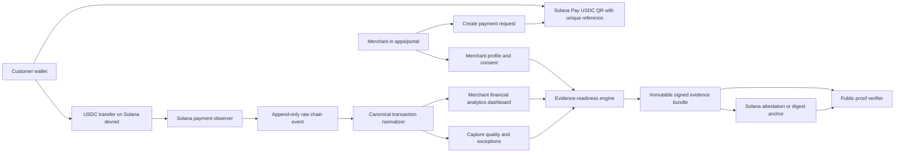

# MCBuse — Colosseum Fall 2026 Hackathon Build Scope

**Status:** Proposed W03 scope-freeze decision  
**Prepared:** 2026-08-16  
**Target event:** Colosseum Fall 2026 Hackathon, September 28–November 2, 2026; event name and final rules to be confirmed when registration opens  
**Product owner:** Asim Emre Aci  
**Engineering owner:** Frederick Obeng Nyarko  
**Customer validation and launch owner:** Berk Ozkan

> **Scope decision:** For the hackathon, MCBuse should prove that a stablecoin payment received by an under-documented merchant can become a trusted financial-data asset. From the same verified history, MCBuse produces useful **financial analytics** for the merchant and an explainable **credit-readiness profile** that can be shared with a lender or other authorized assessor. The existing MCBuse mobile payment app is the first strategic data-generation surface; the hackathon uses a bounded USDC payment over Solana to prove the new data layer without expanding the mobile build. Stablecoins are the payment and data-capture wedge; Solana is the selected implementation network. MCBuse does not approve, price, or fund a loan.

---

## 1. Executive decision

The full MCBuse MVP is too broad for one hackathon. A demo that attempts merchant onboarding, Stripe, Solana, NFC, payouts, KYB, dashboards, credit scoring, admin operations, and production infrastructure will be difficult to finish and hard for a judge to understand.

The hackathon product must tell one complete story:

1. A small merchant creates a profile and consents to activity-data capture.
2. MCBuse creates a merchant-specific request for a low-value USDC stablecoin sale.
3. A customer scans the QR and pays the merchant directly through Solana Pay on devnet.
4. MCBuse detects the finalized transfer, retains its provenance, and normalizes it into a canonical merchant transaction.
5. The merchant dashboard updates its sales and data-quality metrics.
6. MCBuse converts the verified history into understandable financial analytics.
7. MCBuse derives an explainable **credit-readiness** snapshot from the same trusted data.
8. The merchant consents to share a privacy-preserving proof that a third party can verify has not been changed.

This is a stronger Colosseum submission than a generic payment dashboard because the stablecoin payment is both the economic event and the source of verifiable merchant data. Solana provides the fast, low-cost implementation and public provenance for the demonstration.

### One-sentence pitch

**MCBuse turns everyday stablecoin payments from under-documented merchants into trusted financial histories—powering financial analytics and credit readiness.**

### Submission tagline

**Turning stablecoin commerce into merchant financial intelligence.**

### Product category

MCBuse is a **merchant data and financial intelligence company with a stablecoin-payment wedge**. It is not merely a wallet, point-of-sale system, payment gateway, lender, or automated underwriting company. The existing mobile payment app is the first data-generation and distribution surface. The product is the trusted, provider-neutral merchant data layer and the useful outputs created from it: financial analytics for merchants, verifiable credit-readiness evidence, and—over time—decision intelligence for banks and other authorized institutions. The longer-term infrastructure opportunity is to let approved stablecoin issuers integrate once and reach MCBuse merchants through common compliance, payment, and distribution rails.

### Story hierarchy

Use this order in every pitch, document, and demonstration:

1. **Company:** merchant data and financial intelligence.
2. **Hackathon wedge:** stablecoin payments become structured, verifiable merchant activity data.
3. **Existing acquisition asset:** the MCBuse mobile payment app.
4. **Core asset:** a large-scale, longitudinal, provider-neutral merchant financial dataset built with consent.
5. **Immediate merchant value:** understandable financial analytics.
6. **Strategic merchant outcome:** explainable credit readiness and a lender-ready profile.
7. **Institutional value:** better inputs for credit, product, portfolio, and market decisions.
8. **Long-term expansion:** a trusted distribution and payments layer where approved stablecoin issuers integrate once to reach merchants and consumers.
9. **Solana's role:** the selected hackathon network for low-cost USDC movement, public provenance, and tamper evidence—not the headline product category.
10. **Institution's role:** the final financial decision under its own policy and regulatory obligations.

### Submission-ready opening copy

**Title:** MCBuse — Financial Intelligence for Underserved Commerce

**Short description:** MCBuse turns everyday stablecoin payments from under-documented merchants into trusted financial histories—powering financial analytics and credit readiness.

**Secondary description:** MCBuse gives under-documented micro-merchants immediate visibility into business performance and shows whether their verified history is ready for a credit assessment. With consent, the merchant can share tamper-evident supporting evidence with a licensed lender or other authorized assessor, which retains responsibility for underwriting and every credit decision.

**Opening paragraph:** Unbanked and under-documented merchants generate enormous amounts of economic activity, but banks and larger institutions cannot use what they cannot reliably see. Transaction records are fragmented, informal, or trapped inside payment systems. MCBuse already has a mobile payment application that can become the first consistent stablecoin-payment and data-generation surface. The new data layer verifies and standardizes those payments into a longitudinal, provider-neutral merchant record. That record gives merchants useful financial analytics and credit readiness today, while creating consented decision intelligence that can help authorized institutions design and assess better financial products over time. The hackathon uses Solana to carry the USDC payment and integrity proof without publishing detailed merchant records on-chain.

**Technical follow-up:** The existing mobile application demonstrates MCBuse's payment capability but is not yet the canonical merchant data product. The live hackathon flow uses a merchant-specific USDC stablecoin request over Solana as the bounded evidence source. A finalized transfer becomes a canonical transaction, updates financial analytics and readiness inputs, and contributes to a merchant-authorized credit-readiness snapshot. After the hackathon, the same provider boundary can accept events from the MCBuse app, additional approved stablecoins, and approved external payment or commerce providers without changing the canonical data contract.

### Hackathon target

By submission day, a judge must be able to see a real USDC stablecoin payment on Solana devnet move from QR payment to trusted merchant history, financial analytics, an explainable credit-readiness profile, and lender-verifiable evidence in under three minutes.

---

## 2. The problem and the end-to-end story

### 2.1 The merchant problem

Many micro and small merchants generate valuable financial activity every day but do not possess a usable data record of their own business. Their sales may be cash-heavy, fragmented across payment methods, or visible only as unstructured statements. As a result:

- merchants lack reliable financial analytics for daily decisions;
- merchants cannot easily explain the rhythm and reliability of their business;
- payment providers can move money without producing a portable merchant activity record;
- a lender, grant provider, or business partner must rely on incomplete self-reported information;
- the merchant repeatedly starts from zero when asked to prove business activity;
- low-ticket transactions are often ignored even though their frequency is valuable evidence.

The problem is therefore broader than “no credit score.” It begins earlier: **the merchant lacks a consented, structured, and verifiable financial-data foundation.** Without that foundation, the merchant receives neither useful financial analytics nor a credible path to credit assessment.

Banks, microfinance institutions, insurers, development organizations, and other large institutions face the other side of the same problem. They may want to serve these merchants but lack sufficiently consistent, current, and explainable information for responsible decisions. MCBuse's long-term opportunity is not simply to produce one readiness profile; it is to build the consented data infrastructure that makes an economically active but poorly documented merchant segment visible.

### 2.2 The MCBuse intervention

MCBuse captures payment activity at the moment it happens and converts it into a trusted, provider-neutral merchant data record with clear provenance and measured data quality. The same record produces two product outputs:

1. **Financial analytics:** clear sales totals, transaction rhythm, active days, typical ticket size, recent trends, and data-quality indicators.
2. **Credit readiness:** an explainable view of whether the merchant has enough reliable history to be assessed, what is missing, and what evidence can be shared with consent.

At scale, the same longitudinal dataset can support authorized institutions with better inputs for credit assessment, portfolio monitoring, product design, merchant segmentation, and market expansion. Those institutional products are the broad company vision, not hackathon functionality.

The hackathon analytics are limited to verified transaction inflows. MCBuse must not describe them as profit, complete cash flow, affordability, or full financial statements unless expense and liability data are actually captured.

The merchant remains in control:

- the customer pays the merchant directly;
- MCBuse does not make or advertise a lending decision;
- the merchant explicitly consents before an evidence proof is issued;
- institution access is purpose-limited, revocable where applicable, and auditable;
- aggregated market insight must not expose an identifiable merchant without authorization;
- sensitive transaction details remain off-chain;
- only a minimal proof and evidence digest are anchored on Solana;
- the evidence states what was observed and how reliable the data is.

### 2.3 Why stablecoins are central and why Solana is selected

The stablecoin payment is not decorative. It is both the payment instrument and the first clean, programmable source of merchant activity data. For the hackathon, USDC provides a familiar unit of account while Solana provides:

- low-cost USDC payments that are viable for small transaction values;
- fast, public settlement evidence with a unique transaction signature;
- Solana Pay QR requests that can carry a unique payment reference;
- independently verifiable payment provenance;
- a composable place to publish an expiring, privacy-preserving evidence attestation or digest;
- a common verification layer that future capital, insurance, grant, or commerce partners can consume.

### 2.4 What changes for the merchant

Before MCBuse, the merchant generates data but receives little intelligence or portable value from it. After using MCBuse, the merchant has:

- a traceable set of finalized payments;
- a normalized, provider-neutral financial history;
- visible data-quality and integrity measures;
- understandable financial analytics for operating decisions;
- an explainable credit-readiness profile with visible gaps;
- a merchant-controlled assessment package that a lender can verify;
- a credible path from undocumented trading activity to eligibility for responsible loan assessment.

### 2.5 What changes for institutions

Without MCBuse, an institution sees a thin-file merchant, a few unstructured statements, or no usable record at all. With authorized MCBuse data, the institution can receive:

- standardized merchant activity records rather than provider-specific fragments;
- explicit information about data coverage, quality, and provenance;
- current operating patterns and clearly defined observation periods;
- merchant-authorized evidence for individual assessment;
- aggregated, de-identified insight for product and market decisions;
- ongoing data that can later support portfolio monitoring.

The institution remains responsible for interpreting the data, applying policy, complying with regulation, and making the final decision.

### 2.6 The MCBuse data flywheel

1. Stablecoin payments through the existing mobile app and later approved providers generate merchant activity events.
2. MCBuse verifies, standardizes, and measures the quality of those events.
3. Merchants receive analytics and a clearer path to credit readiness.
4. Useful merchant outcomes encourage more consistent digital activity and stronger histories.
5. With consent, institutions receive better assessment and market intelligence.
6. Better institution products create more value for participating merchants and strengthen the data network.

The flywheel must be built as a trusted data partnership, not as unrestricted sale of merchant records.

### 2.7 Two horizons: the wedge first, the platform second

#### Horizon 1 — hackathon wedge

The team will build and prove only the shortest complete loop:

1. one merchant receives one small USDC payment;
2. MCBuse verifies and normalizes it into a merchant-owned financial history;
3. the history produces useful financial analytics;
4. transparent rules show credit readiness and missing evidence;
5. the merchant authorizes a tamper-evident profile for assessment.

This is the current product claim and delivery commitment.

#### Horizon 2 — long-term Stablecoin App Store and distribution infrastructure

The longer-term opportunity is to become a trusted distribution and payments layer where regulated or otherwise approved stablecoin issuers integrate once and gain access to MCBuse merchants and consumers. The strategic platform can eventually include:

- an issuer and stablecoin registry with standardized metadata;
- jurisdiction-aware admission, compliance, risk, suspension, and payment-enablement states;
- common issuer APIs and software integrations;
- currency and stablecoin abstraction so users and merchants do not manage blockchain complexity;
- permitted payment routing based on asset, merchant settlement preference, liquidity, price, and jurisdiction;
- liquidity, foreign-exchange, redemption, and settlement connections through appropriately licensed partners;
- consumer, merchant, issuer, and developer interfaces;
- transaction intelligence across the payment network.

The data company and stablecoin-infrastructure visions reinforce each other. More merchant payments produce stronger longitudinal data; stronger analytics and readiness create more merchant value; a trusted merchant network gives approved issuers meaningful real-economy distribution; more issuers and currencies can then expand merchant reach and payment activity.

MCBuse does not need to predict which stablecoin or blockchain wins. Its intended strategic position is above any single issuer or network: the trusted, interoperable environment connecting suitable stablecoins to merchants, consumers, developers, and—through the data layer—authorized financial institutions.

This horizon is directional, not hackathon scope. The team must not claim to have built issuer certification, multi-stablecoin routing, liquidity, foreign exchange, redemption, fiat settlement, custody, or production compliance operations. Each requires partner, security, and jurisdiction-specific legal validation. MCBuse should remain non-custodial wherever practical and should keep sensitive merchant and identity data off-chain.

The separate Stablecoin App Store concept describes a broader “Stablecoin Store + QR Payment Network MVP.” In this plan, that phrase is treated as a future platform phase, not as an instruction to expand the Colosseum build. The hackathon MVP remains the five-step Horizon 1 loop above.

---

## 3. What “winning” means

Colosseum’s published criteria include functionality, potential impact, novelty, user experience, open-source composability, and business viability. The build must provide evidence for each one.

| Criterion | MCBuse proof |
| --- | --- |
| Functionality | A real devnet USDC payment is detected, finalized, normalized, deduplicated, and shown in the portal. |
| Potential impact | The product targets micro-merchants whose real operating activity is poorly represented in traditional financial data. |
| Novelty | Fragmented payment activity becomes a reusable merchant data asset that powers analytics and portable, consented credit evidence. |
| User experience | A merchant can onboard, receive payment, understand business performance, and see updated credit readiness without handling transaction hashes manually. |
| Open-source and composability | The evidence schema, verification logic, and example integration are public and versioned. |
| Business plan | Payment-data capture is the wedge; evidence and partner APIs can later support paid merchant tools and partner assessment workflows. |

### Non-negotiable submission outcomes

- The public demo is deployed and accessible without the team’s local environment.
- The source repository contains setup instructions and a deterministic demo-data path.
- The primary demo uses a real Solana devnet transaction, not a mocked signature.
- The same transfer cannot create two canonical merchant transactions.
- The evidence-readiness result is explainable from visible inputs.
- The on-chain proof contains no customer PII or raw merchant transaction history.
- The pitch video is under three minutes.
- The technical demo shows the Explorer transaction and evidence verification.
- At least five target-merchant interviews inform the problem statement before submission.

---

## 4. The demo judges should see

### 4.1 Primary three-minute demo

**0:00–0:20 — Problem**  
A micro-merchant generates valuable transaction data every day, but it is fragmented and produces neither useful financial insight nor credible evidence for a lender.

**0:20–0:35 — Product**  
MCBuse turns stablecoin payments from under-documented merchants into trusted financial histories, analytics, and explainable credit readiness.

**0:35–1:05 — Onboard and request payment**  
Open the merchant portal, show the consent status and recipient wallet, enter a small sale amount, and display a Solana Pay QR with a unique reference.

**1:05–1:35 — Pay and capture**  
Scan the QR with a supported wallet, approve the USDC devnet payment, and show the resulting Solana Explorer transaction.

**1:35–2:05 — Create trusted data and analytics**  
Return to the portal. Show the verified sale, updated totals, transaction rhythm, recent trend, and data-quality status. Explain that one trusted merchant history powers every output.

**2:05–2:30 — Show credit readiness**  
Open the readiness panel. Show verified payment count, observed days, active days, volume rhythm, finality rate, capture quality, and the resulting credit-readiness state. Explain each passed or missing requirement and make clear that this is readiness for assessment, not loan approval.

**2:30–2:50 — Share with a lender**  
With merchant consent, issue the assessment package. Open the lender-verification view and show that the evidence digest matches the on-chain record without exposing unnecessary transaction details.

**2:50–3:00 — Vision**  
Connect the proof to the existing MCBuse mobile payment app. Explain that each future app payment can strengthen a consented merchant history: analytics create immediate value, credit readiness creates a financing path, and the growing longitudinal dataset can help banks and other institutions make better decisions. Institutions retain responsibility for approval, pricing, limits, underwriting, and regulatory compliance.

### 4.2 Demonstration dataset

The live payment proves the real-time flow. A seeded, clearly labelled 30-day history proves how the evidence view behaves over time. Seeded records must use deterministic fixtures and must never be presented as real merchant traction.

Prepare four deterministic states:

1. `insufficient_evidence` — fewer than the minimum observation requirements;
2. `building_history` — valid activity exists but the evidence window is incomplete;
3. `evidence_ready` — all completeness and integrity requirements pass;
4. `integrity_review` — a critical unresolved data-integrity exception exists.

### 4.3 Demo fallback

If devnet or the wallet is unavailable during a live presentation, replay a previously captured and sanitized finalized transaction through the same normalization pipeline. The video must still show the real Explorer record used to create the fixture. A mocked `mock_*` signature is not acceptable as the submission’s primary proof.

---

## 5. Scope priorities

### P0 — Required for submission

- merchant profile, recipient wallet, consent, and onboarding state;
- authenticated merchant portal in `apps/portal`;
- USDC Solana Pay transfer request and QR generation;
- unique per-payment reference and pending payment record;
- Solana devnet payment detection and finalized-transfer verification;
- append-only raw chain evidence and canonical transaction normalization;
- idempotency by network, signature, and reference;
- merchant financial analytics dashboard with transactions, daily/hourly trends, ticket-size metrics, and data-quality status;
- evidence-readiness snapshot with visible inputs and deterministic rules;
- merchant-controlled evidence issuance;
- on-chain evidence attestation or digest plus public verification page;
- seeded 30-day dataset and deterministic replay fixtures;
- role enforcement, audit events, health checks, tests, deployment, README, pitch video, and technical demo.

### P1 — Valuable if P0 is stable

- internal admin view for merchants, ingestion health, and exceptions;
- revocation or supersession of an issued evidence snapshot;
- downloadable evidence JSON and human-readable PDF;
- a small provider-neutral adapter demonstration using a sanitized Stripe fixture;
- responsive PWA polish and installability;
- merchant interview evidence and one recorded usability test;
- a reusable TypeScript verifier example for a third party.

### P2 — Only after the submission is already safe

- live Stripe Payment Link capture as a second provider;
- Stripe payout and balance-transaction matching;
- hourly activity visualizations;
- multi-member merchant organizations;
- email notifications;
- advanced admin recovery actions.

### Explicitly out of scope

- NFC;
- production KYB or AML ownership;
- lending, loan origination, or capital disbursement;
- a predictive credit score;
- approval, rejection, pricing, limit, or interest-rate decisions;
- mainnet funds;
- customer custody by MCBuse for the hackathon flow;
- refunds, disputes, or chargeback operations beyond preserving data integrity;
- bank payouts or fiat settlement;
- multi-country or multi-provider production rollout;
- accounting integrations;
- changes to `apps/web` beyond an optional link to the demo;
- new work in the Expo application.

---

## 6. Credit readiness: the correct minimum scope

### 6.1 Product language

Lead with **merchant credit readiness** and the goal of helping merchants establish demonstrable creditworthiness. Use **evidence readiness** for the narrower technical state that says the underlying record is complete enough to share. Do not claim “credit approval,” a predictive “credit score,” or a final lending decision. The hackathon product answers:

> Has this merchant built enough verified, internally consistent activity history to be ready for a lender's creditworthiness assessment, and what evidence or observation is still missing?

It does not answer:

> Should this merchant receive a loan, at what price, or for what amount?

### 6.2 Evidence inputs

The snapshot should be derived only from records MCBuse can prove or explicitly label:

| Group | Signal | Meaning |
| --- | --- | --- |
| Identity and consent | Merchant ID, recipient wallet, consent version, consent timestamp, KYB status | Who owns the activity and whether sharing is authorized. KYB remains status-only. |
| Observation | Window start/end, observed days, active days, last payment time | Whether enough time and activity have been observed. |
| Activity | Finalized payment count, volume in integer minor units, median ticket, 7/30-day trend, sales volatility | Descriptive business rhythm; not a prediction. |
| Integrity | Capture quality, finality rate, duplicates ignored, malformed/missed counts | How trustworthy and complete the captured dataset is. |
| Exceptions | Open critical exception count and reason codes | Whether unresolved evidence problems require review. |
| Provenance | Network, transaction signatures, evidence schema version, snapshot digest | How a verifier can trace and validate the result. |

Do not use customer names, customer wallet addresses, precise location trails, protected characteristics, social data, contact lists, or unverified self-reported revenue as readiness inputs.

### 6.3 Evidence-readiness stages

The rules must be deterministic, versioned, and visible in the UI. Initial demonstration thresholds are product-completeness thresholds, not underwriting policy.

| Stage | Demonstration rule |
| --- | --- |
| `integrity_review` | Any unresolved critical integrity exception or evidence-digest mismatch exists. |
| `insufficient_evidence` | Fewer than 7 observed days or fewer than 5 finalized payments exist. |
| `building_history` | Some valid history exists, but one or more evidence-ready requirements are not met. |
| `evidence_ready` | At least 30 observed days, 10 active days, 25 finalized payments, 98% capture quality, 98% finality rate, active consent, and no critical integrity exception. |

The UI must show the failed and passed conditions. It must also state: **“Evidence-ready is not a credit approval.”**

### 6.4 Evidence bundle v1

Create a canonical, versioned JSON document containing:

```json
{
  "schemaVersion": "mcbuse.merchant-evidence.v1",
  "subject": "merchant_public_id_or_hash",
  "network": "solana-devnet",
  "window": {
    "from": "2026-09-01T00:00:00.000Z",
    "to": "2026-09-30T23:59:59.999Z"
  },
  "readinessStage": "evidence_ready",
  "activity": {
    "finalizedPaymentCount": 42,
    "volumeMinor": "184500000",
    "currency": "USDC",
    "activeDays": 16
  },
  "integrity": {
    "captureQualityBps": 10000,
    "finalityRateBps": 10000,
    "openCriticalExceptions": 0
  },
  "consentVersion": "merchant-evidence-consent-v1",
  "generatedAt": "2026-10-20T12:00:00.000Z",
  "expiresAt": "2027-01-18T12:00:00.000Z"
}
```

Canonicalize the JSON, calculate a SHA-256 digest, sign the bundle with the MCBuse evidence issuer, and persist the immutable snapshot. The verifier recomputes the digest and compares it with the on-chain proof.

### 6.5 On-chain proof

Preferred implementation:

- create a versioned schema and credential using the Solana Attestation System;
- issue an expiring attestation containing only the subject identifier/hash, schema version, readiness stage, observation period, evidence digest, issued time, and expiry;
- link the portal and public verifier to the attestation and Explorer transaction.

Fallback if the attestation spike fails early:

- submit the same minimal digest payload through a signed Solana transaction using the Memo program;
- store the transaction signature in the evidence snapshot;
- keep the verifier behavior unchanged;
- describe Solana Attestation System migration as the immediate next step.

No raw transaction list, revenue details, customer address, email, phone, legal name, or KYB document may be written on-chain.

---

## 7. Target architecture



### Architecture decisions

1. `apps/web` remains the public marketing site.
2. `apps/portal` is the authenticated merchant and admin PWA.
3. `apps/api/src/data-capture` owns merchant identity, consent, payment adapters, raw evidence, canonical transactions, quality, evidence snapshots, and query APIs.
4. The merchant supplies or confirms a Solana recipient address; the primary demo sends funds directly to that address.
5. MCBuse observes and verifies payments but does not take custody in the primary hackathon flow.
6. The existing wallet ledger is not the canonical merchant transaction store.
7. Provider-specific events are converted into one canonical transaction contract.
8. Monetary values use integer minor units, timestamps use UTC, and identifiers are unique within their provider/network.
9. Sensitive activity remains off-chain; only minimal, merchant-authorized proof data is public.
10. Stripe remains a later adapter and fixture source, not the primary hackathon payment path.

---

## 8. Repository-grounded module plan

### 8.1 Reuse, adapt, and park

| Existing component | Decision | Hackathon use |
| --- | --- | --- |
| NestJS application shell, validation, Helmet, throttling, Pino, Swagger, health | Reuse | Foundation for all new APIs and operational proof. |
| `SolanaModule` and `SolanaService` RPC connection | Reuse and extend | Read finalized transfers, references, blocks, and transaction evidence. |
| `chain-watcher/solana-onramp-reconcile.service.ts` | Reference its scheduling and parsed-transaction patterns only | The current watcher matches by wallet, amount, and time and uses decimal-number conversion. Merchant capture must instead verify the Solana Pay reference, use integer units, and track finality. |
| `payments/providers/solana-transfer.provider.ts` | Reference and test fallback | It proves SPL transfers, but its server-custodied payer flow is not the customer-facing checkout. |
| `payment-requests` service and schema | Adapt patterns only | Reuse expiry, nonce, integer amounts, and state-machine ideas; replace `mcbuse://` QR with a Solana Pay request and merchant ownership. |
| Auth, refresh-token rotation, lockout, and verified-email guard | Reuse and extend | Add merchant/admin role and merchant membership. Do not rely only on portal route hiding. |
| Drizzle/PostgreSQL and migrations | Reuse | Add isolated data-capture tables and constraints. |
| Audit log schema | Reuse and extend | Add an audit service and required writes for consent and evidence issuance. |
| Existing ledger | Keep separate | It remains the wallet ledger, not the merchant activity source of truth. |
| Stripe client and signed webhook pattern | Defer or fixture | Useful for the provider adapter, but not needed for the primary demo. |
| `apps/web` | Preserve | Marketing only. |
| Existing Expo mobile payment app and NFC module | Strategic asset; park new hackathon work | The app proves an existing payment surface and is the first planned source of merchant activity data. Reference it in the company story, but do not claim it already produces the new canonical merchant dataset or expand it during the hackathon. |

### 8.2 Module A — Merchant identity, recipient, and consent

**Location:** `apps/api/src/data-capture/merchants`, `apps/api/src/data-capture/consent`, `apps/portal/app/(merchant)/onboarding`

Build:

- merchant profile with immutable public merchant ID;
- ownership/membership link to the authenticated user;
- merchant-provided Solana recipient address with validation;
- onboarding state and status-only KYB field;
- versioned consent record with actor, timestamp, purpose, and evidence hash;
- merchant/admin authorization guards;
- audit events for recipient changes, consent, and status changes.

Done when:

- one user can access only their merchant;
- an admin can inspect all demo merchants;
- a payment request cannot be created without active consent and a valid recipient;
- changing the recipient creates a new auditable version rather than rewriting evidence;
- consent history is immutable and exportable.

### 8.3 Module B — Payment request and Solana Pay QR

**Location:** `apps/api/src/data-capture/payment-requests`, `apps/portal/app/(merchant)/payments/new`

Build:

- dynamic payment request with amount, USDC mint, merchant, label, description, expiry, and unique reference public key;
- Solana Pay URL and QR generation;
- pending/observed/confirmed/finalized/expired/failed state machine;
- printable or full-screen QR view;
- API response containing a safe Explorer-ready network context.

Done when:

- a supported wallet recognizes the QR as a USDC payment;
- the merchant address, token, and amount displayed in the wallet match the request;
- two requests never share a reference;
- expired requests cannot be marked paid by an unrelated transfer;
- the demo request can be completed from a prepared devnet payer wallet.

### 8.4 Module C — Solana payment observer and verifier

**Location:** `apps/api/src/data-capture/providers/solana`, `apps/api/src/data-capture/ingestion`

Build:

- provider adapter contract for observed payment events;
- polling observer for open references, with a bounded backoff strategy;
- direct RPC fetch of candidate transactions;
- verification of cluster, mint, recipient, amount, reference, status, and finality;
- append-only raw event persistence before normalization;
- replay command/service for deterministic fixtures;
- unique constraint on network and transaction signature.

Done when:

- a devnet payment appears automatically without pasting a signature;
- only the intended USDC transfer satisfies the request;
- `confirmed` and `finalized` are not treated as the same state;
- a duplicate observation is a no-op and is recorded as such;
- an invalid amount, mint, recipient, or reference becomes an explainable exception;
- raw RPC evidence is retained with secrets and irrelevant personal data excluded.

### 8.5 Module D — Canonical transactions and data quality

**Location:** `apps/api/src/data-capture/transactions`, `apps/api/src/data-capture/quality`, `apps/api/src/data-capture/exceptions`

Build:

- versioned canonical transaction object;
- Solana event normalizer;
- capture states: captured, malformed, missed, and duplicate;
- exception reason codes and severity;
- capture quality calculation;
- daily summary aggregation;
- source-to-canonical provenance links.

Capture quality remains:

```text
captured / (captured + malformed + missed)
```

Duplicates are safely ignored and excluded from the denominator.

Done when:

- all money is stored as integer base units;
- all times are UTC;
- a canonical transaction links to its raw event, payment request, merchant, and signature;
- replaying the same raw event cannot change merchant totals;
- the quality calculation is covered by tests for empty, malformed, missed, and duplicate cases.

### 8.6 Module E — Merchant financial analytics dashboard

**Location:** `apps/portal/app/(merchant)/dashboard`, `apps/portal/app/(merchant)/transactions`

Build:

- today and 30-day volume;
- finalized payment count;
- average and median ticket size;
- recent transaction list;
- payment status/finality and Explorer links;
- daily and hourly activity rhythm;
- 7-day versus 30-day sales trend;
- capture quality and last-captured timestamp;
- exceptions requiring merchant attention;
- clear separation between live and seeded demo data.

Done when:

- a finalized live payment updates the UI without a full page reload or manual database change;
- empty, loading, delayed, degraded, and error states are designed;
- every total can be traced to canonical records;
- every financial metric is labelled as verified sales activity rather than profit, affordability, or complete cash flow;
- seeded records are visually labelled as demonstration data.

### 8.7 Module F — Evidence-readiness engine

**Location:** `apps/api/src/data-capture/evidence`, `packages/merchant-evidence`

Build:

- pure, versioned calculation function;
- aggregation of observation, activity, integrity, and exception signals;
- stage result with passed/failed conditions and reason codes;
- evidence bundle canonicalization and digest generation;
- immutable snapshot persistence;
- unit tests for stage boundaries and digest stability;
- JSON schema and TypeScript types for external consumers.

Done when:

- the same canonical inputs always produce the same readiness result and digest;
- changing one input changes the digest;
- the UI explains the result without hidden inputs;
- no readiness stage is labelled as a loan decision;
- a third-party example can parse and validate the published schema.

### 8.8 Module G — Evidence issuance and public verification

**Location:** `apps/api/src/data-capture/attestations`, `apps/portal/app/(merchant)/evidence`, `apps/portal/app/verify/[id]`

Build:

- merchant confirmation before issuance;
- issuer key and network configuration isolated from the web client;
- Solana Attestation System spike and selected implementation;
- minimal on-chain data payload;
- issued/expired/superseded lifecycle;
- public verifier that fetches the snapshot, recomputes the digest, checks the signature, and resolves the on-chain proof;
- Explorer link and human-readable verification result.

Done when:

- issuance fails closed without active consent;
- the proof can be independently located on devnet;
- editing the evidence bundle causes verification to fail;
- expired or superseded evidence is visibly marked;
- no confidential merchant or customer fields appear on-chain.

### 8.9 Module H — Admin, audit, security, and operations

**Location:** `apps/portal/app/admin`, `apps/api/src/data-capture/admin`, shared auth/audit/health infrastructure

Build:

- minimal merchant list, ingestion health, unresolved exception list, and snapshot status;
- server-enforced merchant/admin authorization;
- required audit writes for consent, evidence calculation, issuance, supersession, and manual exception action;
- rate limits for request generation and public verification;
- structured logs with correlation IDs;
- readiness endpoint covering database, RPC, and observer lag;
- secret/config validation and safe public error responses.

Done when:

- merchant A cannot query merchant B;
- non-admin users cannot access admin APIs;
- issuer keys and wallet secrets never reach the browser or logs;
- health output reports degraded RPC/observer state without leaking secrets;
- the demo operator can identify a stuck request and its reason.

### 8.10 Module I — Deployment, tests, and submission

**Location:** repository root, deployment configuration, `docs/`, public README

Build:

- staging deployment for API, portal, and database;
- deterministic seed and replay commands;
- clean-database migration check;
- unit, integration, and one end-to-end happy-path test;
- one invalid-payment and one duplicate-payment test;
- demo accounts and safe devnet payer setup instructions;
- architecture diagram, public evidence schema, setup guide, known limitations, pitch script, technical demo script, and submission copy.

Done when:

- a fresh reviewer can run the repository from the README;
- deployed portal and API pass the smoke checklist;
- the demo can be rehearsed three consecutive times;
- the submission makes no claim that cannot be demonstrated or evidenced.

---

## 9. Planned data contracts

### 9.1 Core records

| Record | Required fields |
| --- | --- |
| `merchant` | ID, public ID, display/legal name, owner, status, KYB status, created/updated timestamps. |
| `merchant_recipient` | Merchant, network, address, status, valid-from/to, verification evidence. |
| `consent_record` | Merchant, actor, version, purpose, granted/revoked time, immutable evidence digest. |
| `payment_request` | Merchant, network, token mint, amount minor, reference, recipient, expiry, state. |
| `raw_provider_event` | Provider/network, unique event identity, observed time, payload, processing state, payload digest. |
| `canonical_transaction` | Merchant, request, provider, signature, amount minor, currency, event/finality timestamps, status. |
| `capture_exception` | Merchant, event/request, reason code, severity, state, evidence, resolution metadata. |
| `evidence_snapshot` | Merchant, schema/rule version, period, inputs, result, bundle digest, signature, issue/expiry state. |
| `evidence_anchor` | Snapshot, network, mechanism, address/signature, issued time, expiry/supersession state. |

### 9.2 Canonical transaction v1

```ts
type CanonicalMerchantTransactionV1 = {
  id: string;
  merchantId: string;
  paymentRequestId: string;
  provider: 'solana';
  network: 'devnet';
  providerEventId: string;
  transactionSignature: string;
  reference: string;
  recipient: string;
  tokenMint: string;
  amountMinor: string;
  currency: 'USDC';
  status: 'observed' | 'confirmed' | 'finalized' | 'failed';
  eventTime: string;
  finalizedAt: string | null;
  rawEventId: string;
  schemaVersion: 'mcbuse.transaction.v1';
};
```

### 9.3 Minimum API surface

Merchant APIs:

- `POST /merchants`
- `GET /merchants/me`
- `POST /merchants/me/recipient`
- `POST /merchants/me/consents`
- `GET /merchants/me/consents`
- `POST /merchants/me/payment-requests`
- `GET /merchants/me/payment-requests/:id`
- `GET /merchants/me/summary`
- `GET /merchants/me/transactions`
- `GET /merchants/me/capture-quality`
- `GET /merchants/me/evidence-readiness`
- `POST /merchants/me/evidence-snapshots`
- `POST /merchants/me/evidence-snapshots/:id/issue`

Public verification API:

- `GET /evidence/:publicId`
- `GET /evidence/:publicId/verify`

Admin APIs:

- `GET /admin/merchants`
- `GET /admin/exceptions`
- `GET /admin/ingestion-health`
- `GET /admin/evidence-snapshots`

---

## 10. Issue-ready work breakdown

The following items are the concrete hackathon backlog. Every item should contain its own tests, evidence, dependencies, and non-goals when converted to Linear.

| ID | Work item | Output and acceptance evidence | Depends on |
| --- | --- | --- | --- |
| H01 | Confirm fall event registration, rules, submission fields, and eligibility | Written checklist with official dates, team registration state, code-start rules, video limits, and submission deadline. | None |
| H02 | Freeze the hackathon story, target merchant, and claims | Approved one-sentence pitch, problem statement, exclusions, and claim/evidence register. | H01 |
| H03 | Complete five target-merchant problem interviews | Notes and synthesis showing whether fragmented activity records and finance-readiness are real pains. No fabricated traction. | H02 |
| H04 | Spike Solana Pay QR, devnet USDC, reference matching, and wallet compatibility | Real Explorer signature plus a written go/no-go decision for the exact checkout path. | H02 |
| H05 | Spike Solana Attestation System and approve fallback | One retrievable devnet attestation or documented failure and approved digest-anchor fallback. | H02 |
| H06 | Create `apps/portal` and authenticated merchant/admin shells | Responsive deployed routes with auth, empty states, and server-side role checks. | H02 |
| H07 | Add merchant, recipient, membership, and consent schema | Clean migration, seed, immutable consent test, and authorization test. | H02 |
| H08 | Add payment request, raw event, canonical transaction, exception, snapshot, and anchor schema | Clean migration, uniqueness constraints, integer-money and UTC contract tests. | H04, H05, H07 |
| H09 | Implement merchant onboarding and recipient verification | Merchant can complete onboarding and cannot create payment request before prerequisites pass. | H06, H07 |
| H10 | Implement Solana Pay USDC request and QR | Supported wallet displays correct recipient, amount, token, label, and unique reference. | H04, H08, H09 |
| H11 | Implement Solana observer and finalized-payment verifier | Live payment is detected automatically and invalid payment variants are rejected with reasons. | H04, H08, H10 |
| H12 | Implement raw persistence, normalization, idempotency, and replay | Raw-before-normalize behavior, duplicate safety, canonical record, and deterministic fixture tests. | H08, H11 |
| H13 | Implement capture quality, exceptions, and summaries | Tested quality formula and visible reason-coded exceptions. | H12 |
| H14 | Build merchant transactions and financial analytics dashboard | Live payment updates totals, history, activity rhythm, ticket-size metrics, finality, quality, and Explorer link. | H06, H12, H13 |
| H15 | Implement evidence-readiness rules and explanation API | Versioned pure rules, boundary tests, visible pass/fail criteria, and required disclaimer. | H07, H12, H13 |
| H16 | Implement immutable evidence bundle, signature, and digest | Stable canonicalization and tamper-detection tests. | H15 |
| H17 | Implement evidence issuance and public verifier | Merchant consent gates issuance; on-chain proof resolves; edited/expired evidence fails or warns correctly. | H05, H16 |
| H18 | Build minimal admin health and exception view | Admin sees merchant state, observer lag, exceptions, and evidence status; merchant cannot access it. | H06, H13, H17 |
| H19 | Harden secrets, audit, rate limits, and degraded states | Security checklist, audit evidence, safe errors, and RPC/database health results. | H09–H18 |
| H20 | Create seed data, replay fixtures, and smoke test | Four readiness states, real sanitized transfer fixture, and one-command validation path. | H12–H19 |
| H21 | Deploy staging and run repeated end-to-end QA | Public URL, clean migration, three successful rehearsals, and recorded defect disposition. | H20 |
| H22 | Publish open evidence schema and verifier example | Versioned schema, integration example, and setup instructions in public repository. | H16, H17 |
| H23 | Produce pitch video, technical demo, and submission copy | Under-three-minute pitch, direct technical demo, accurate project description, and final links. | H03, H21, H22 |

---

## 11. Calendar and gates

The public schedule states that the fall 2026 hackathon runs from September 28 through November 2. This plan uses the period before kickoff to remove technical uncertainty and gather validation, then uses the official build window to finish and present the product. Confirm the exact fall rules before relying on pre-kickoff code in the submitted work.

### Pre-hackathon — August 17 to September 27

#### Gate A — Scope and evidence, due August 30

- H01–H03 complete;
- one narrative and target merchant approved;
- at least five merchant interviews scheduled, with early findings captured;
- claim/evidence register prevents unsupported statements;
- P0/P1/P2 scope locked.

#### Gate B — Technical feasibility, due September 6

- H04 and H05 complete;
- one real Solana devnet payment has a reference and Explorer signature;
- the evidence-anchor mechanism is selected;
- wallet compatibility and test-token setup are documented;
- any blocker forces a scope cut before portal implementation expands.

#### Gate C — Data and portal foundation, due September 20

- H06–H09 complete;
- clean migrations and deterministic seed work;
- merchant authentication, recipient, and consent are demonstrable;
- canonical contracts are frozen.

#### Gate D — Pre-kickoff vertical slice, due September 27

- H10–H12 have a local happy path;
- live or fixture payment becomes one canonical record;
- top demo risks and fallback steps are documented;
- no P2 work has started.

### Hackathon week 1 — September 28 to October 4

- harden H10–H12 using the official competition environment;
- complete live QR-to-finalized-transaction path;
- add invalid amount/mint/recipient/reference cases;
- deploy the first internal preview.

**Gate:** one repeatable real-payment vertical slice exists.

### Hackathon week 2 — October 5 to October 11

- complete H13–H14;
- build quality, exceptions, summaries, and merchant financial analytics;
- run the first end-to-end usability session.

**Gate:** merchant value is visible immediately after payment.

### Hackathon week 3 — October 12 to October 18

- complete H15–H17;
- show all four evidence-readiness states;
- issue and independently verify the first evidence proof.

**Gate:** the differentiating credit-readiness story works end to end.

### Hackathon week 4 — October 19 to October 25

- complete H18–H22;
- harden admin, authorization, audit, observability, fixtures, deployment, and public schema;
- freeze features at the end of the week.

**Gate:** deployed product is reliable, explainable, and reviewable.

### Submission week — October 26 to November 2

- complete H23;
- fix only submission-blocking bugs;
- rehearse the exact three-minute demo;
- verify every claim and link;
- submit early enough to recover from platform or upload failures.

**Gate:** public demo, public code, pitch, technical walkthrough, validation evidence, and accurate submission are all live.

---

## 12. Team responsibilities

### Asim — product, business, and risk

- approve scope, claims, evidence-readiness language, and business model;
- own H01 and H02;
- confirm that the product is framed as evidence infrastructure, not lending;
- prepare market sizing assumptions and business model;
- review compliance, custody, consent, and partner language;
- present the long-term partner and financing story.

### Frederick — engineering and technical demonstration

- own H04–H22 technical delivery;
- keep `apps/web` unchanged and build the product in `apps/portal`;
- preserve the merchant/wallet domain boundary;
- prove Solana payment and evidence verification on devnet;
- own security, tests, deployment, architecture, and technical demo;
- cut features when a gate fails rather than hiding unfinished behavior.

### Berk — merchant evidence and presentation

- own H03 with Asim’s support;
- recruit and interview Munich/Berlin target merchants;
- test whether onboarding, QR creation, dashboard language, and evidence explanation are understandable;
- capture permissioned quotes or anonymized findings;
- own the demo narrative, visual clarity, and launch communication;
- coordinate the pitch recording and submission assets with the team.

### Whole team

- rehearse the demo;
- verify all claims;
- respond to forum feedback;
- make the repository and product understandable to a reviewer with no prior MCBuse context.

---

## 13. Business model to present

The hackathon should not invent lending revenue that the product does not yet earn.

Present a staged model:

1. **Merchant analytics software:** free or low-cost tools that organize verified activity and provide useful financial analytics.
2. **Data and evidence services:** paid, consented access to standardized merchant datasets, evidence bundles, and verification for authorized lenders, grant providers, insurers, or payment partners.
3. **Institutional decision intelligence:** paid, permissioned tools for portfolio monitoring, merchant segmentation, product design, and market insight using appropriately aggregated or merchant-authorized data.
4. **Readiness and monitoring workflows:** partner-paid fees for evidence refreshes, data-quality monitoring, and assessment-support workflows.
5. **Future payment economics:** revenue share or service fee through licensed payment/ramp partners where legally and commercially appropriate.
6. **Future stablecoin distribution infrastructure:** issuer integration, API, distribution, payment-processing, and compliance/reporting services once the required partnerships and permissions exist.

The defensible asset is the longitudinal, merchant-consented, provider-neutral financial-data layer and the intelligence produced from it—not custody of merchant funds or unrestricted sale of raw merchant records.

---

## 14. Competitive positioning

Merchant payment products already exist in the Solana ecosystem, and Yumi Finance has demonstrated crypto BNPL using on-chain and off-chain underwriting data. MCBuse should not claim to be the first Solana merchant payment product or the first use of on-chain data in credit.

The credible differentiation is narrower:

- focus on low-ticket micro-merchant activity capture;
- direct conversion of verified payment events into a reusable merchant financial-data record;
- explicit data-quality measurement;
- financial analytics and credit readiness produced from the same trusted history;
- an existing mobile payment surface that can become a first-party data channel;
- longitudinal institutional intelligence as the scale opportunity;
- merchant consent and data minimization;
- provider-neutral evidence rather than a lender-specific decision;
- portable verification through an open schema and on-chain digest/attestation;
- a bridge from payment acceptance to future partner assessment.

The presentation should compare MCBuse with categories, not attack individual projects:

| Category | Primary value | MCBuse distinction |
| --- | --- | --- |
| Merchant payment gateway | Accept and settle payments | Treats payment as a data-capture event and creates a reusable merchant record. |
| Merchant analytics dashboard | Reports transactions | Adds verified provenance, measured data quality, readiness gaps, and portable evidence. |
| BNPL or lender | Makes a financing decision | Stops before decisioning and supplies consented evidence to authorized assessors. |
| Credit bureau or institutional data provider | Supplies decision data to institutions | Builds the record from merchant activity at source, returns analytics to the merchant, and exposes data only through consented or appropriately aggregated products. |
| On-chain reputation | Scores a wallet | Uses merchant-scoped, purpose-limited evidence and explains data completeness. |

### 14.1 Crowdedness and truthful positioning

As of 2026-08-16, Colosseum Copilot contains two historical MCBuse submissions. The April 2025 Breakout description—“banking services for the unbanked” and “sharing economy”—is assigned to **Simplified Solana Payment Solutions**, a cluster containing **223 projects**. The September 2025 Cypherpunk description—“fintech infrastructure for data-driven banking”—is assigned to **Stablecoin Payment Rails and Infrastructure**, a cluster containing **202 projects**. These are cluster project counts, not quality scores out of 100.

The earlier concise formulation—**“credit readiness for under-documented micro-merchants using verified sales records to build lender-ready profiles”**—returned WarungChain and Kikasete as its two closest projects in a 184-project cluster. The new data-company story materially changes the wording, so that estimate is now obsolete and must not be presented as the current score. Re-run the crowdedness analysis against the final title, tagline, and description before submission.

The short description must remain concise. Adding “credit scoring,” “lending dashboard,” or detailed assessment-package language to the opening causes the nearest set to drift toward the 257-project DeFi lending cluster; “financial identity” drifts toward the 260-project identity cluster. Those details belong in the problem, demo, and technical explanation—not the title, tagline, or first sentence.

The submission should position MCBuse as the missing **merchant financial-data layer** for under-documented micro-businesses. MCBuse is not another payment rail, reporting dashboard, BNPL checkout, lender, or opaque wallet score. Its wedge is to capture trustworthy activity once, measure its quality, convert it into useful financial analytics, explain credit-readiness gaps, and let the merchant share a verifiable history.

Use these category signals in the title, tagline, first paragraph, demo opening, and submission video:

- merchant data and financial intelligence;
- financial analytics from verified transaction history;
- credit readiness for under-documented micro-merchants;
- explainable evidence of merchant creditworthiness;
- verified sales history and consented transaction provenance;
- visible readiness gaps and actions to improve them;
- portable, lender-verifiable merchant evidence;
- open evidence schema and independent verification.

Do not describe the hackathon product as only one of these categories:

- generic stablecoin payment gateway or payment rail;
- QR payments or point of sale;
- automated credit scoring, loan approval, lending capital, or BNPL checkout;
- wallet, settlement, or merchant acquiring.

The demo should open on fragmented merchant data, show one transaction becoming a trusted record, show the financial analytics created from the growing history, explain which credit-readiness checks pass or fail, and end with a lender-view verification step. **Financial analytics and credit readiness are the two primary outputs of the merchant data layer.**

### 14.2 Comparable-project signal

The closest merchant-side matches are `warungchain` from Breakout in April 2025 and `kikasete` from Cypherpunk in September 2025. Neither was returned in the winner-only or accelerator-only sets. WarungChain combines small-business POS, lending, and inventory analytics; Kikasete provides verifiable proof of real-world store activity. MCBuse is narrower: verified sales history becomes an explainable lender-ready profile, with visible data-quality and readiness gaps.

The winner-only and accelerator-only searches are led by `yumi-finance`, the September 2025 Cypherpunk DeFi winner and a C4 company. Yumi leads with BNPL and underwriting. Decal leads with merchant payments and loyalty, while LocalPay leads with stablecoin QR payments. MCBuse occupies the layer before loan decisioning: it helps a merchant build and present the verified operating history needed to become assessable.

Outside Colosseum, StreetCredit already markets cash-flow, POS, and mobile-money data infrastructure to African SME lenders, while Evidara helps African SMEs create structured, review-ready business records. Alternative credit bureaus and scoring providers such as Notto and Tausi go further into credit decisioning. MCBuse must therefore own the **merchant-side readiness journey**: capture activity at source, show whether the record is trustworthy, explain what the merchant must build next, and let the merchant selectively present a portable, independently verifiable profile. It must not claim that alternative transaction data or African SME credit infrastructure is itself novel.

---

## 15. Backlog impact and W03 decisions

The current MVP backlog places the full QR-to-dashboard flow after the September start and the end-to-end gate at November 29. That sequence is too late for a November 2 submission.

W03 should approve the following changes:

1. Create a hackathon milestone ending November 2, 2026, or tag the hackathon work without changing the long-term pilot milestones.
2. Pull the usable parts of merchant onboarding, QR capture, ingestion, dashboard, and quality work ahead of their existing November dates.
3. Add the evidence-readiness engine and proof-verification work as the hackathon differentiator.
4. Keep Stripe feasibility as architectural learning, but remove live Stripe payout matching from the hackathon P0 path.
5. Keep the long-term provider adapter boundary so Stripe and licensed partners can be added after the hackathon.
6. Replace the current “credit readiness state” language with the evidence-readiness stages in this document.
7. Retain the explicit exclusions for credit scoring and underwriting.
8. Park NFC and the Expo app throughout the hackathon.
9. Do not modify `apps/web` into the portal.
10. Do not start P1 or P2 work while any P0 end-to-end gate is failing.

### Mapping to the existing MVP work

| Existing work | Hackathon treatment |
| --- | --- |
| W03 backlog and scope freeze | Use this document as the decision input. |
| W04 Stripe feasibility | Complete as a bounded learning spike; add Solana Pay and attestation feasibility as the hackathon gates. |
| W05–W07 schema and architecture | Bring forward and narrow to the Solana capture/evidence contracts. |
| W09 portal skeleton | Bring forward before kickoff. |
| W10 admin skeleton | Reduce to a minimal operations view and deliver after merchant flow. |
| W11 quality and security requirements | Bring forward; required by evidence readiness. |
| W13 onboarding | Bring forward and limit KYB to status-only. |
| W14 QR provisioning | Replace the hackathon primary path with Solana Pay USDC; retain Stripe Payment Link for later MVP work. |
| W15 ingestion | Bring forward and implement provider-neutral raw/canonical boundaries with Solana first. |
| W16 E2E | Bring forward; the hackathon gate is QR to finalized payment to dashboard. |
| W17–W20 payout and exception work | Keep exceptions; defer full Stripe payout matching until after submission. |
| W21 KPI work | Implement only the activity, quality, and evidence metrics used in the demo. |
| W22 security | Pull forward the merchant/admin authorization, consent, issuer-secret, audit, and rate-limit subset. |

---

## 16. Cut order when delivery slips

Cut scope in this order:

1. PDF export;
2. live second-provider/Stripe adapter;
3. advanced charts;
4. admin recovery actions;
5. PWA install polish;
6. evidence supersession UI, while preserving expiry and verification status;
7. Solana Attestation System implementation only if the approved digest-anchor fallback is already working.

Never cut:

- real devnet payment proof;
- payment verification and idempotency;
- canonical transaction provenance;
- merchant dashboard update;
- explainable evidence-readiness result;
- merchant consent before issuance;
- tamper-evident proof and public verification;
- role enforcement, secret safety, or the core tests;
- deployment and submission assets.

---

## 17. Risks and mitigations

| Risk | Trigger | Mitigation |
| --- | --- | --- |
| The fall event details change | Official registration/rules differ from the published schedule | H01 is a hard gate; update dates and submission requirements before work is locked. |
| The product looks like another QR payment app | Pitch focuses on checkout screens | Lead with verified merchant evidence; demonstrate the proof verifier and open schema. |
| Solana feels incidental | Stripe is the only live payment path | Make Solana Pay, finalized transaction provenance, and the on-chain evidence proof the primary demo. |
| “Credit readiness” is interpreted as unlicensed scoring | UI uses eligible/approved/score language | Use evidence-readiness stages, explicit disclaimers, versioned rules, and no loan recommendation. |
| Devnet USDC or wallet setup is unreliable | Supported wallet cannot complete the QR flow | Complete H04 early, keep a prepared payer wallet, retain a real sanitized replay fixture, and record the working path. |
| Reference matching is ambiguous | A transfer matches by recipient/amount only | Use a unique reference per request and verify transaction instructions directly through RPC. |
| Observer double-counts a transfer | Polling repeats or process restarts | Unique network/signature constraint plus idempotent normalization. |
| Evidence exposes merchant or customer data | Raw volume or addresses are written on-chain | Publish only minimal proof fields and a digest; keep detailed evidence access-controlled off-chain. |
| Attestation integration takes too long | No retrievable devnet attestation by Gate B | Use the signed digest-anchor fallback and preserve the same evidence/verifier interface. |
| Seeded data is mistaken for traction | Demo blends seeded and live records | Label seed data clearly and state the exact number of real interviews and live payments. |
| Portal work consumes the schedule | Design polish begins before vertical slice | Build the plain end-to-end path first and freeze features one week before submission. |
| Existing custodial wallet design expands regulatory/security risk | Demo requires MCBuse to hold customer funds or keys | Use a merchant recipient address and customer-signed Solana Pay transfer in the primary flow. |

---

## 18. Final definition of done

The hackathon build is complete only when all of the following are true:

- the official team registration and submission requirements are satisfied;
- the public portal and API are deployed;
- a merchant can onboard, register a recipient, and grant consent;
- the portal creates a valid USDC Solana Pay QR with a unique reference;
- a customer-signed devnet payment reaches the intended merchant recipient;
- the observer detects and verifies the transfer through RPC;
- raw evidence is stored before normalization;
- one and only one canonical transaction is produced;
- the transaction becomes finalized and updates merchant totals;
- capture quality and exceptions are correct and tested;
- the evidence-readiness result is deterministic and explainable;
- the evidence bundle is immutable, signed, and tamper-evident;
- the merchant explicitly authorizes proof issuance;
- the on-chain proof is retrievable and the public verifier validates it;
- confidential activity is not written on-chain;
- merchant/admin authorization and audit requirements pass;
- a clean database can migrate and seed successfully;
- the happy path, duplicate path, invalid-payment path, and tamper path are tested;
- the complete demo succeeds three consecutive times;
- the README, architecture, evidence schema, public verifier example, pitch video, technical demo, and submission text are live;
- every public claim is supported by code, a link, an interview record, or an explicitly labelled assumption.

---

## 19. Required submission artifacts

- deployed merchant portal URL;
- deployed public evidence verifier URL;
- public source repository;
- concise README with architecture and quick start;
- versioned merchant evidence JSON schema;
- third-party verification example;
- Solana Explorer links for the demo payment and evidence proof;
- under-three-minute pitch video;
- direct technical demo video;
- five or more anonymized merchant interview findings;
- one-page business model and go-to-market summary;
- known limitations and post-hackathon roadmap;
- deterministic demo seed and replay instructions;
- submission claim/evidence checklist.

---

## 20. Sources and constraints

- Colosseum’s published 2026 schedule states that the fall event runs September 28–November 2, 2026: <https://blog.colosseum.com/2026-hackathons-updraft-course-offline-signer-cli/>
- Colosseum’s official winning guidance emphasizes a focused working product, user feedback, business viability, and a concise presentation: <https://blog.colosseum.com/how-to-win-a-colosseum-hackathon/>
- The Frontier 2026 rules list functionality, impact, novelty, UX, open-source composability, and business plan as judging criteria; the fall rules must still be confirmed: <https://colosseum.com/legal/Solana%20Frontier%20Hackathon%20Rules.pdf>
- Solana Pay supports USDC transfer requests, QR codes, unique references, and payment validation: <https://solana.com/docs/tools/solana-pay/quickstart/transfer-requests>
- Solana’s payment documentation recommends direct transaction reads when reference-based correlation is required: <https://platform.solana.com/docs/payments/accept-overview>
- Solana Attestation System provides credentials, schemas, expiring attestations, and authorized issuers: <https://solana.com/docs/tools/attestations>
- Colosseum’s portfolio shows existing merchant-payment and crypto-underwriting products, including Decal and Yumi Finance; MCBuse must use the narrower differentiation defined above: <https://colosseum.com/companies>
- Research on decentralized identifiers and verifiable credentials supports user-controlled, independently verifiable records while also identifying real adoption and implementation challenges: <https://arxiv.org/abs/2402.02455v2>
- Data portability is the strategic basis for keeping merchant evidence provider-neutral rather than locked inside a payment or lending platform: <https://a16zcrypto.com/posts/article/how-web3-data-portability-reduces-the-power-of-centralized-services>
- StreetCredit demonstrates current African lender demand for cash-flow, POS, and mobile-money data on thin-file SMEs: <https://www.streetcredit.capital/>
- Evidara demonstrates the adjacent merchant-recordkeeping category and the value of review-ready trading histories: <https://www.evidara.org/>
- The World Bank's alternative-data research documents how merchant payment histories can help SMEs build credit profiles and qualify for credit access: <https://documents.worldbank.org/curated/en/701331497329509915/pdf/116186-WP-AlternativeFinanceReportlowres-PUBLIC.pdf>
- Internal product direction and operating roles come from [`team_plan.md`](./team_plan.md).
- Repository reuse and separation decisions come from [`month1-demo-audit.md`](./month1-demo-audit.md) and [`month1-architecture-decisions-and-risks.md`](./month1-architecture-decisions-and-risks.md).

---

## W03 approval record

W03 is unblocked when the team explicitly approves or amends these six statements:

1. **Primary hackathon payment:** USDC stablecoin through Solana Pay on devnet. Stablecoin is the product rail; Solana is the selected implementation network.
2. **Primary product outcome:** verified merchant activity becomes a trusted financial-data record that powers merchant analytics and explainable, lender-verifiable credit readiness; institutional decision intelligence is the scale vision, not hackathon functionality.
3. **Credit boundary:** no credit score, approval, pricing, limit, or lending operation.
4. **Technical boundary:** new `apps/portal` plus `apps/api/src/data-capture`; `apps/web` remains marketing. The existing Expo payment app is a strategic data-capture asset and may appear in the story, but Expo/NFC implementation remains parked during the hackathon.
5. **Delivery rule:** the P0 vertical slice and submission proof take precedence over Stripe payout matching and all P1/P2 features until November 2, 2026.
6. **Data-trust boundary:** MCBuse does not sell unrestricted raw merchant records. Identifiable evidence is purpose-limited and merchant-authorized; broader institutional insight is appropriately aggregated or de-identified and all access is controlled and auditable.
