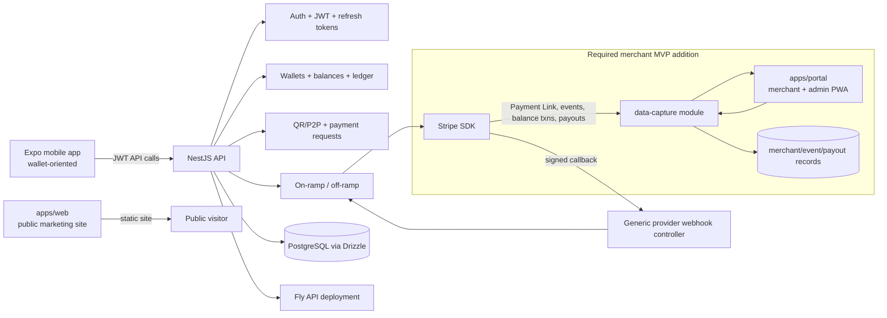

# Month 1 Demo Audit — Draft

**Ticket:** MCB-6 — W01: Audit the existing MCBuse demo and map reusable components  
**Date:** 2026-08-05  
**Scope:** repository state on `main`; no product-code changes made by this audit.

## Executive summary

MCBuse already has a usable NestJS/Drizzle foundation for authentication, logging,
Stripe client access, signed webhook handling, migrations, and Fly deployment. Those
pieces are worth retaining. The existing business model is a **custodial stablecoin
wallet**: users receive a savings/routine wallet pair, top up, transfer, swap, pay,
and cash out. It is not yet a merchant payment-capture system.

The merchant MVP should therefore be additive:

- preserve `apps/web` as the public marketing site;
- add `apps/portal` for merchant and admin use;
- add an API `data-capture` module cluster with merchant, provider-event,
  canonical-transaction, payout, and exception records;
- reuse the Stripe SDK and signature-verification pattern, but do **not** route
  merchant capture through the wallet top-up settlement workflow;
- leave `apps/mobile` intact and out of the pilot-critical path.

The largest delivery risk is Stripe evidence: the current code proves the SDK and
webhook plumbing exist, but it has no Payment Link provisioning, raw event journal,
balance-transaction ingestion, payout matching, or sandbox evidence trail.

## Evidence collected

| Check | Result |
| --- | --- |
| Repository state | `main`; pre-existing modified `apps/mobile/app/(tabs)/_layout.tsx` and untracked `docs/build_timeline.md` were not changed by this audit. |
| API test suite | `pnpm --filter api exec jest --runInBand --watchman=false`: **11 suites / 41 tests passed**. |
| Default test command | `pnpm --filter api test -- --runInBand` fails before Jest runs because sandboxed Watchman cannot write its LaunchAgent file. Use `--watchman=false` in local/CI test commands. |
| Database migrations | Drizzle migrations `0000` through `0007` are present. |
| Automation | No repository CI workflow was found. |
| Deployment | API-only Fly configuration and Dockerfile are present; no portal/web deployment configuration is present. |

## Current architecture map

## Inventory and reuse decisions

| Area | Current state | Recommendation | Reason / required adaptation |
| --- | --- | --- | --- |
| Monorepo/tooling | pnpm workspace and Turborepo with API, web, mobile, and shared packages. | **Keep** | Suitable for an additive `apps/portal` and API module. Add portal build/deploy coverage later. |
| API foundation | NestJS modules are registered in `apps/api/src/app.module.ts`; global validation, Helmet, Pino logging, Swagger, throttling, and raw body are enabled in `main.ts`. | **Keep** | Strong starting point. Add the data-capture module rather than folding capture logic into on/off-ramp services. |
| Authentication | Email/password, phone OTP, JWT access tokens, refresh-token rotation, account lockout, and email-verification guard exist. JWT payload currently contains only user ID/email. Signup always creates a wallet pair. | **Keep and extend** | Reuse credential/session code. Add merchant/admin role and merchant membership/ownership separately; decouple merchant/admin creation from automatic wallet creation. |
| Audit logging | `audit_logs` schema stores actor, action, entity, metadata, IP, and correlation ID. | **Keep and extend** | Schema is a useful base, but no cross-cutting audit service guarantees merchant/admin mutations are recorded. Add service/coverage in W22. |
| Stripe SDK | `StripeClient` centralizes the SDK and is injected through `StripeModule`. | **Keep** | Use it for Payment Links, event retrieval, balance transactions, payouts, and test fixtures. |
| Webhook ingress | Nest raw body is enabled; `/webhooks/:provider` verifies Stripe signature before JSON parsing. Existing handling routes only on-ramp/off-ramp event families and logs unsupported events. | **Keep pattern; replace routing for merchant capture** | New capture endpoint/adapter must preserve signature verification, persist the provider event before normalization, and handle retries/duplicates/dead letters. Do not overload wallet-session settlement. |
| On-ramp Stripe integration | Checkout fallback creates a session and maps checkout/payment-intent events into `onramp_transactions`, then credits a custodial wallet. `ONRAMP_PROVIDER=stripe` currently resolves to the mock provider for the legacy API path. | **Do not reuse as merchant capture domain** | Reuse SDK/config/verification only. Its wallet metadata, USD-to-USDC settlement, and provider selection are incompatible with merchant payment recording. |
| Off-ramp Stripe integration | Stripe Connect and payout-related code exists, but `OFFRAMP_PROVIDER=stripe` currently resolves to mock for the legacy API path. | **Reference only** | Payout event parsing may inform W04/W18, but merchant payout matching must model Stripe platform payment flow independently. |
| Ledger/balances | Integer `bigint` amounts, idempotency key, wallet transfers, and user transaction summaries exist. | **Keep as wallet subsystem; do not make canonical merchant ledger** | Merchant transaction capture needs provider references, merchant scope, raw event provenance, and payout links not represented in `ledger_entries`. Integer-money policy should be reused. |
| Database/migrations | Drizzle, PostgreSQL pool configuration, schema index, and migrations are established. Current schemas cover users, wallets, balances, payment requests, on/off-ramp transactions, ledger, refresh tokens, and audit logs. | **Keep and extend** | Add isolated data-capture tables/migrations; retain raw JSON only where justified and avoid merchant data in wallet tables. |
| Public web | `apps/web` is a Next.js public marketing site, with a single landing-page route and landing components. | **Keep unchanged** | It is not a dashboard shell. Create `apps/portal` rather than mixing merchant/admin authentication into marketing routes. |
| Mobile | Expo Router contains consumer wallet flows: top up, cash out, transfer, swap, QR scan/receive, invoice, and NFC dependency. | **Park** | Useful demonstration context but not part of the QR-based merchant pilot. Do not delete or extend for MVP. |
| Tests | API has 11 unit suites covering providers, payment requests, transactions, rates, and users. There is an e2e file but no merchant capture coverage. | **Keep and extend** | Add deterministic Stripe fixtures plus ingestion, matching, RBAC, and portal tests. Disable Watchman for this environment. |
| Deployment | Fly config deploys the API only. Production config currently uses `DATABASE_SSL=no-verify`, mock OTP, and zero minimum running machines. Dockerfile builds/copies only API. | **Keep as a starting point; harden** | M8 needs portal deployment, environment separation, backup/restore, TLS-validated database config, non-mock production OTP decision, and operational monitoring. |

## Current data-model fit

Existing schemas are primarily user/wallet scoped:

- `users` includes identity/profile fields and an optional Stripe Connect account ID, but
  no role, merchant organization, consent, or KYB state.
- `wallets`, `balances`, and `ledger_entries` model custodial asset movement.
- `onramp_transactions` and `offramp_transactions` persist provider transactions and
  raw webhook payloads for wallet funding/cash-out, not merchant sales.
- `audit_logs` has no enforcement path and is not a replacement for immutable provider
  event provenance.

The merchant MVP therefore needs new canonical records rather than field additions to
wallet tables: merchant profile, consent/version record, raw provider event,
normalized merchant transaction, payout, transaction-to-payout association, exception,
and KPI inputs. All monetary data should use integer minor units and all event times
should be stored as UTC.

## Reuse boundary for the new data-capture module

The new module should own:

1. merchant identity/onboarding and consent;
2. provider adapter interfaces and signed event ingestion;
3. append-only raw event provenance and idempotency;
4. canonical transaction normalization and reconciliation;
5. payout/balance-transaction matching and exception evaluation;
6. merchant/admin query endpoints and KPI computation.

It may depend on the existing database, configuration, Stripe client, logging, and
authentication services. It should not depend on wallet balances, Solana settlement,
or on-ramp session completion to represent merchant activity.

## Gaps and technical risks observed

| Risk / gap | Impact | Mitigation owner / next ticket |
| --- | --- | --- |
| No Payment Link, merchant metadata, balance-transaction, payout, or raw-event implementation exists. | The core product claim is unproven. | W04 feasibility spike; W05–W06 schema; W14–W18 implementation. |
| Existing generic Stripe webhook ignores unsupported events after verifying them. | Required merchant events could be silently discarded. | W15 stores every verified supported event before normalization and records unsupported/dead-letter state. |
| Legacy Stripe provider selection maps `stripe` to mock for core on/off-ramp providers. | A configuration name can imply a real integration when the API uses mock behavior. | W02 records the decision; W04 isolates the merchant adapter from legacy selection. |
| Auth has no role/membership model and signup creates wallets automatically. | Merchant/admin portal cannot safely use the existing identity model as-is. | W11 defines RBAC; W13/W22 implement roles and merchant ownership without wallet side effects. |
| No CI workflow and default Jest invocation is Watchman-dependent. | Regressions and environment-specific failures may go undetected. | W02 risk register; W24 establishes reproducible verification; M8 adds deployment checks. |
| Fly production configuration uses `DATABASE_SSL=no-verify`, mock OTP, and auto-stop. | Not suitable as a pilot security/availability baseline. | W22 security checklist and W29 production hardening. |
| Current API only deploys through the Dockerfile; web has no portal deployment path. | `apps/portal` would not be deployable by default. | W09 scaffold; W29 deployment/environment work. |
| Existing mobile has parallel root and grouped receive routes and legacy consumer flows. | UI reuse could create scope creep and route confusion. | Park mobile; treat any mobile reuse as post-pilot work. |

## Draft conclusion

Proceed with the additive merchant data-capture architecture. Keep the API/Drizzle/
Stripe-authentication foundations, preserve the public website, and keep the mobile app
outside the pilot path. The Month 1 gate is not yet complete: W02 must convert these
findings into accepted decisions/risks, W03 needs stakeholder validation, and W04 needs
real Stripe sandbox evidence or deterministic fixtures for unavailable payout behavior.
